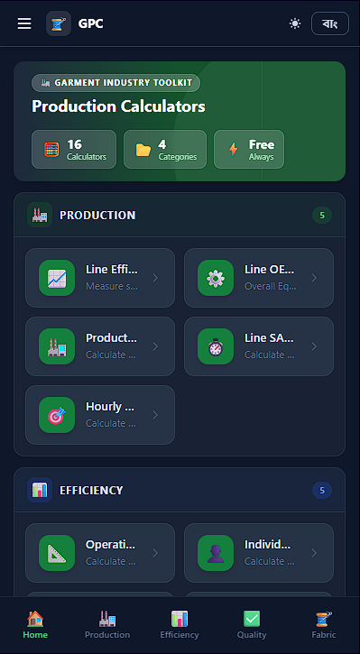

# 🧵 GPC - Garments Production Calculator

> **A comprehensive web-based calculator suite for production planning, efficiency analysis, and quality control in the garment manufacturing industry.**

[](https://your-demo-url.com)
[](https://vuejs.org/)
[](https://tailwindcss.com/)
[](LICENSE)

---

## 📋 Table of Contents

- [Overview](#-overview)
- [Features](#-features)
- [Calculators](#-calculators)
- [Demo](#-demo)
- [Installation](#-installation)
- [Usage](#-usage)
- [Technology Stack](#-technology-stack)
- [Project Structure](#-project-structure)
- [Contributing](#-contributing)
- [License](#-license)
- [Contact](#-contact)

---

## 🎯 Overview

**GPC (Garments Production Calculator)** is a professional-grade, free-to-use web application designed specifically for the garment manufacturing industry. It provides 16 specialized calculators covering production planning, efficiency metrics, quality control, and fabric consumption calculations.

### Why GPC?

- ✅ **100% Free & Open Source** - No hidden costs or subscriptions
- 🌐 **Works Offline** - Progressive Web App capabilities
- 📱 **Mobile Responsive** - Use on any device
- 🌍 **Bilingual Support** - English & বাংলা (Bangla)
- 🌙 **Dark Mode** - Easy on the eyes during long shifts
- ⚡ **Lightning Fast** - Built with modern Vue 3 & Vite
- 🎨 **Beautiful UI** - Professional design with Tailwind CSS
- 📊 **Industry Standard Formulas** - Accurate calculations trusted by IE professionals

---

## ✨ Features

### 🔧 Core Features

- **16 Production Calculators** covering all major garment production metrics
- **Bilingual Interface** - Switch between English and Bangla instantly
- **Dark/Light Mode** - Comfortable viewing in any environment
- **Responsive Design** - Seamless experience on desktop, tablet, and mobile
- **Real-time Calculations** - Instant results as you type
- **Formula Display** - Learn the math behind each calculation
- **Input Validation** - Smart error handling with helpful hints
- **Clean UX** - Intuitive interface designed for factory floor use

### 🎨 User Experience

- Modern, professional interface
- Category-based calculator organization
- Helpful tooltips and input hints
- Visual feedback and ratings
- Print-friendly results
- No login required

---

## 🧮 Calculators

### 📈 Production & Efficiency (6 Calculators)

1. **📐 Operation SAM/SMV Calculator**
   - Calculate Standard Allowed Minutes for garment operations
   - Uses time study data with performance rating and allowances

2. **📈 Line Efficiency Calculator**
   - Measure sewing line efficiency
   - Compare actual output vs available capacity

3. **⚙️ Line OEE Calculator**
   - Overall Equipment Effectiveness
   - Analyzes Availability × Performance × Quality

4. **👤 Individual Employee Efficiency**
   - Calculate single operator efficiency
   - Track individual performance metrics

5. **👥 Employee Efficiency (Multi-Operation)**
   - Efficiency across multiple operations
   - Ideal for operators working on different tasks

6. **🏭 Production Capacity Calculator**
   - Calculate daily production capacity
   - Plan output based on SAM and efficiency

### ⏱️ Production Planning (2 Calculators)

7. **⏱️ Line SAH Calculator**
   - Standard Allowed Hours earned by production line
   - Essential for capacity planning

8. **🎯 Hourly Production Target**
   - Calculate expected output per hour
   - Set realistic targets based on SAM and efficiency

### 💪 Productivity Analysis (2 Calculators)

9. **💪 Labour Productivity Calculator**
   - Output per worker analysis
   - Assess workforce productivity

10. **🔧 Machine Productivity Calculator**
    - Output per machine evaluation
    - Measure machinery utilization

### 🔍 Quality Control (1 Calculator)

11. **🔍 Quality DHU Calculator**
    - Defects per Hundred Units (DHU)
    - Industry-standard quality measurement
    - Includes rejection rate and quality ratings

### 👕 Fabric Consumption (5 Calculators)

12. **👕 T-Shirt Fabric Consumption**
    - Calculate knitted fabric required for T-shirts
    - Includes body, sleeve, and wastage calculations

13. **👔 Woven Shirt Fabric Consumption**
    - Woven fabric requirements for shirts
    - Accounts for collar, cuffs, and marker efficiency

14. **⚖️ Knits: Kg → Meter Conversion**
    - Convert fabric weight to length
    - Essential for fabric ordering

15. **📏 Knits: Meter → Kg Conversion**
    - Convert fabric length to weight
    - Plan fabric requirements accurately

16. **🔄 Knits: Kg → Yards Conversion**
    - Convert weight to yards
    - Useful for US market specifications

---

## 🎬 Demo

### Screenshots

**Home Screen - Light Mode**


**Calculator Interface - Dark Mode**


**Mobile Responsive**


### Live Demo

👉 **[Try GPC Live](https://your-demo-url.com)**

---

## 🚀 Installation

### Prerequisites

- Node.js 16.x or higher
- npm or yarn package manager

### Quick Start

```bash
# Clone the repository
git clone https://github.com/your-username/GPC.git

# Navigate to project directory
cd GPC

# Install dependencies
npm install

# Start development server
npm run dev
```

The app will be available at `http://localhost:5173`

### Build for Production

```bash
# Create optimized production build
npm run build

# Preview production build locally
npm run preview
```

---

## 💻 Usage

### Basic Workflow

1. **Select Calculator** - Choose from 16 specialized calculators on the home screen
2. **Enter Values** - Fill in the required input fields
3. **Get Results** - View instant calculations with formulas
4. **Analyze** - Review performance ratings and recommendations

### Example: Calculating Line Efficiency

```
Inputs:
- Number of Operators: 30
- Working Hours: 8
- SAM (minutes): 15
- Line Efficiency: 75%
- Pieces Produced: 960

Results:
✅ Line Efficiency: 75%
📊 Minutes Produced: 14,400
⏱️ Minutes Available: 19,200
🎯 Target @ 100%: 1,280 pieces
```

### Tips for Best Results

- Use realistic performance ratings (typically 75-125%)
- Include proper allowances (10-20% typical)
- Verify SAM values from time studies
- Cross-check with actual production data

---

## 🛠️ Technology Stack

### Frontend Framework
- **Vue 3** - Progressive JavaScript Framework
- **Vue Router** - Official routing library
- **Composition API** - Modern Vue development

### Styling & UI
- **Tailwind CSS** - Utility-first CSS framework
- **Custom Design System** - Consistent color palette and spacing
- **Responsive Grid** - Mobile-first approach

### Build Tools
- **Vite** - Next-generation frontend tooling
- **PostCSS** - CSS transformation
- **Autoprefixer** - Automatic vendor prefixing

### Development
- **JavaScript ES6+** - Modern JavaScript features
- **Hot Module Replacement** - Instant updates during development
- **Optimized Production Builds** - Code splitting and minification

---

## 📁 Project Structure

```
GPC/
├── public/                 # Static assets
├── src/
│   ├── assets/            # Images, fonts
│   ├── components/        # Reusable Vue components
│   ├── composables/       # Vue composables (useTheme, useLang)
│   │   ├── useTheme.js   # Dark mode logic
│   │   └── useLang.js    # Internationalization
│   ├── i18n/             # Language files
│   │   ├── en.js         # English translations
│   │   └── bn.js         # Bangla translations
│   ├── router/           # Vue Router configuration
│   │   └── index.js      # Route definitions
│   ├── views/            # Page components
│   │   ├── Home.vue      # Home page
│   │   └── calculators/  # Calculator components
│   │       ├── OperationSAM.vue
│   │       ├── LineEfficiency.vue
│   │       ├── LineOEE.vue
│   │       ├── EmployeeEfficiency.vue
│   │       ├── EmployeeEfficiencyMulti.vue
│   │       ├── ProductionCapacity.vue
│   │       ├── LineSAH.vue
│   │       ├── HourlyTarget.vue
│   │       ├── LabourProductivity.vue
│   │       ├── MachineProductivity.vue
│   │       ├── QualityDHU.vue
│   │       ├── TShirtFabric.vue
│   │       ├── WovenShirtFabric.vue
│   │       ├── KgToMeter.vue
│   │       ├── MeterToKg.vue
│   │       └── KgToYards.vue
│   ├── App.vue           # Root component
│   ├── main.js           # Application entry point
│   └── style.css         # Global styles
├── index.html            # HTML template
├── package.json          # Project dependencies
├── vite.config.js        # Vite configuration
├── tailwind.config.js    # Tailwind configuration
├── postcss.config.js     # PostCSS configuration
└── README.md             # This file
```

---

## 🤝 Contributing

Contributions are welcome! Whether it's:

- 🐛 Bug reports
- 💡 Feature requests
- 📝 Documentation improvements
- 🔧 Code contributions

### How to Contribute

1. **Fork** the repository
2. **Create** a feature branch (`git checkout -b feature/amazing-feature`)
3. **Commit** your changes (`git commit -m 'Add amazing feature'`)
4. **Push** to the branch (`git push origin feature/amazing-feature`)
5. **Open** a Pull Request

### Development Guidelines

- Follow Vue 3 best practices
- Maintain bilingual support (EN & BN)
- Test calculators with real-world data
- Keep formulas accurate and industry-standard
- Write clean, commented code
- Update documentation for new features

---

## 📄 License

This project is licensed under the **MIT License** - see the [LICENSE](LICENSE) file for details.

### What this means:
- ✅ Free for commercial use
- ✅ Free to modify
- ✅ Free to distribute
- ✅ Free for private use

---

## 👨‍💻 Author

**Your Name**

- LinkedIn: [Your LinkedIn Profile](https://www.linkedin.com/in/md-homayun-kabir-00433017a)
- GitHub: [@your-username](https://github.com/homayungit)
- Email: homayun18bd@gmail.com

---

## 🙏 Acknowledgments

- Industrial Engineering formulas from garment industry standards
- Vue.js community for excellent documentation
- Tailwind CSS for the utility-first approach
- All contributors who help improve this project

---

## 📊 Project Stats

- **16** Production Calculators
- **2** Languages (English & Bangla)
- **100%** Free & Open Source
- **0** Dependencies for core calculations
- **⚡** Lightning fast performance

---

## 🗺️ Roadmap

### Planned Features

- [ ] Export results to PDF/Excel
- [ ] Save calculation history
- [ ] Batch calculations
- [ ] Additional language support (Hindi, Chinese)
- [ ] Factory dashboard with multiple calculators
- [ ] Mobile app (iOS & Android)
- [ ] API for integration with ERP systems
- [ ] Advanced reporting and analytics
- [ ] Calculator presets for common garment types

---

## 📞 Support

Having issues? Need help?

1. Check the [Issues](https://github.com/homayungit/GPC/issues) page
2. Open a new issue with detailed description
3. Join our community discussions
4. Contact via LinkedIn

---

## ⭐ Star This Repository

If you find GPC useful, please consider giving it a ⭐ on GitHub!

It helps others discover the project and motivates continued development.

---

<div align="center">

**Made with ❤️ for the Garment Industry**

[⬆ Back to Top](#-gpc---garments-production-calculator)

</div>
